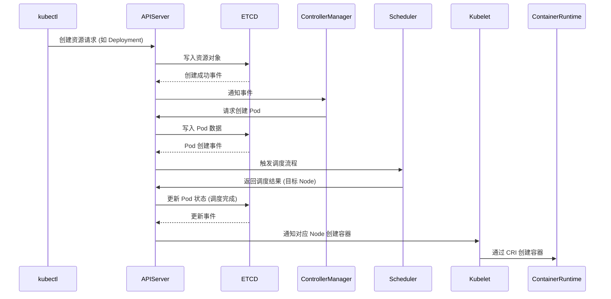
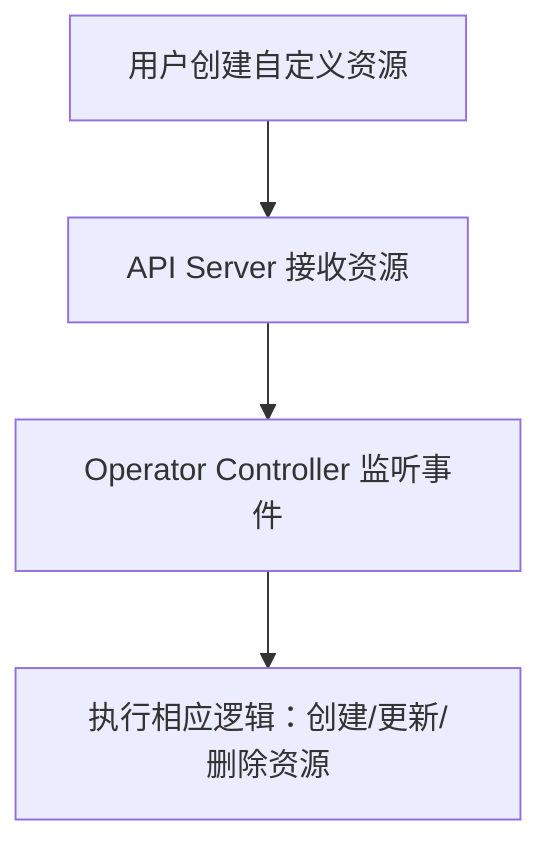
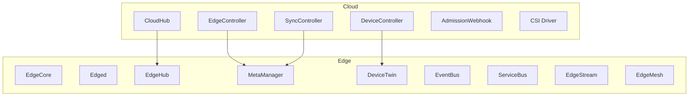

# Kubernetes (K8s) 知识总结

---

## 一、Kubernetes 核心组件及其作用

| 组件名          | 作用 |
|-----------------|------|
| **etcd**        | 分布式键值数据库，存储所有集群状态数据 |
| **api-server**  | 提供 Kubernetes 的 REST API 接口，作为集群通信核心 |
| **controller-manager** | 监控集群状态，负责副本数量控制、状态维护等 |
| **scheduler**   | 负责 Pod 调度，将 Pod 分配到合适的 Node 上 |
| **kubelet**     | 节点管理器，与容器运行时交互，管理容器生命周期 |
| **kube-proxy**  | 负责集群网络服务，创建 iptables 或 ipvs 规则实现服务转发 |

---

## 二、YAML 创建资源的完整流程

---

## 三、Deployment vs StatefulSet 对比

| 特性 | Deployment | StatefulSet |
|------|------------|-------------|
| Pod 命名 | 随机后缀 | 有序编号（如 pod-0, pod-1） |
| 网络标识 | 不稳定 | 稳定，唯一 |
| 存储 | 可选（默认不保留） | 与 Pod 绑定的持久存储 |
| 应用场景 | 无状态服务，如 Web 应用 | 有状态服务，如数据库 |

---

## 四、Operator 原理与优势

### 核心组成
- **CRD（CustomResourceDefinition）**：定义自定义资源类型；
- **控制器（Controller）**：监控自定义资源的变化并响应处理逻辑。

### 工作流程

### 优势
- 简化复杂系统部署
- 支持自动化升级/运维
- 保持状态一致性和可观察性

---

## 五、KubeEdge 架构与模块说明

### 架构图

---

### EdgeCore 组件详解

| 模块        | 说明 |
|-------------|------|
| **Edged**       | EdgeCore 主进程，负责模块初始化与设备通信 |
| **EdgeHub**     | 与云端 CloudHub 通信，设备身份认证与注册 |
| **MetaManager** | 元数据管理器，提供设备状态和配置查询 |
| **DeviceTwin**  | 设备虚拟模型，实现远程配置与状态同步 |
| **EventBus**    | 消息总线，模块间发布/订阅事件机制 |
| **ServiceBus**  | 服务间通信机制，支持 REST/gRPC |
| **EdgeStream**  | 实时数据流处理模块 |
| **EdgeMesh**    | 轻量级边缘通信协议模块，支持多协议通信 |

---

### CloudCore 组件详解

| 模块 | 说明 |
|------|------|
| **CloudHub** | 云边消息分发与接收 |
| **EdgeController** | 管理边缘节点和应用部署 |
| **DeviceController** | 定义设备 CRD，管理设备生命周期 |
| **SyncController** | 保障云边数据一致性 |
| **CSI Driver** | 云边存储插件支持 |
| **Admission Webhook** | 校验边缘应用配置合法性 |

---

## 六、总结建议

- 熟悉 K8s 核心组件和事件驱动架构，有助于理解 Operator、CRD、Scheduler 行为；
- 有状态应用部署应优先使用 StatefulSet，并结合 PVC 使用；
- 对于分布式设备系统或边缘应用场景，可优先考虑 KubeEdge 作为边云协同平台；
- 资源创建流程建议结合图示深入掌握调度与状态传播过程。

---